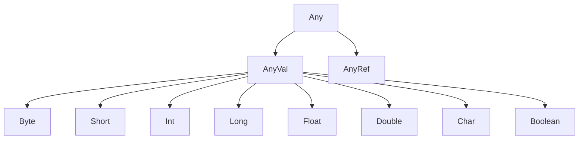

```mermaid
graph TD;
    Any --> AnyVal;
    Any --> AnyRef;
    AnyVal --> Byte;
    AnyVal --> Short;
    AnyVal --> Int;
    AnyVal --> Long;
    AnyVal --> Float;
    AnyVal --> Double;
    AnyVal --> Char;
    AnyVal --> Boolean;
```
