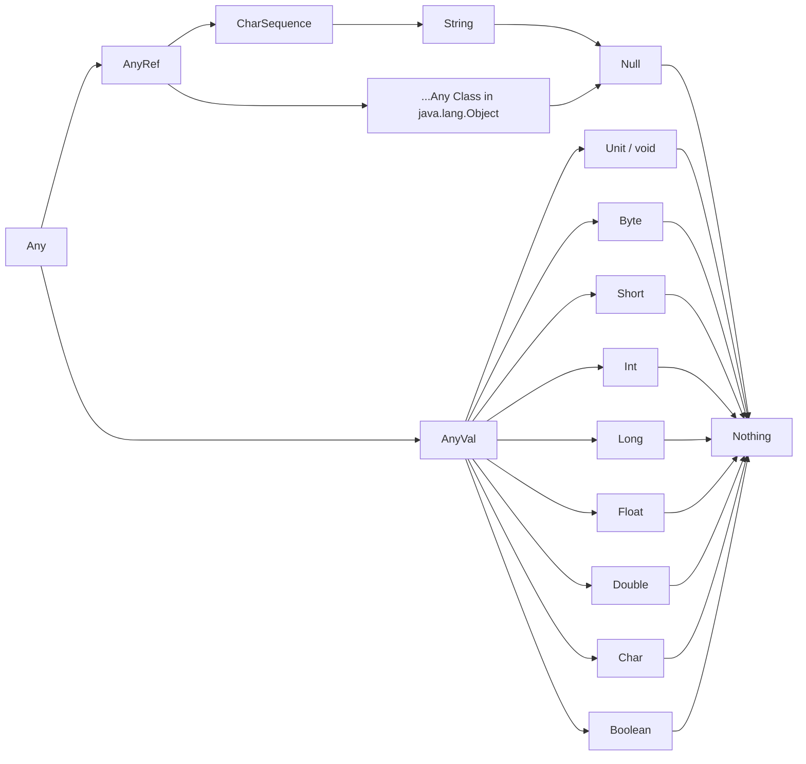

```mermaid
flowchart LR
    Any --> AnyVal;
    Any --> AnyRef;
    AnyVal --> Byte;
    AnyVal --> Short;
    AnyVal --> Int;
    AnyVal --> Long;
    AnyVal --> Float;
    AnyVal --> Double;
    AnyVal --> Char;
    AnyVal --> Boolean;
    AnyVal --> Unit[Unit / void];
    AnyRef --> X[...Any Class in java.lang.Object];
    AnyRef --> CharSequence;
    CharSequence --> String;
    String --> Null;
    X --> Null;
    Null --> Nothing;
    Unit --> Nothing;
    Byte --> Nothing;
    Short --> Nothing;
    Int --> Nothing;
    Long --> Nothing;
    Float --> Nothing;
    Double --> Nothing;
    Char --> Nothing;
    Boolean --> Nothing;
```
