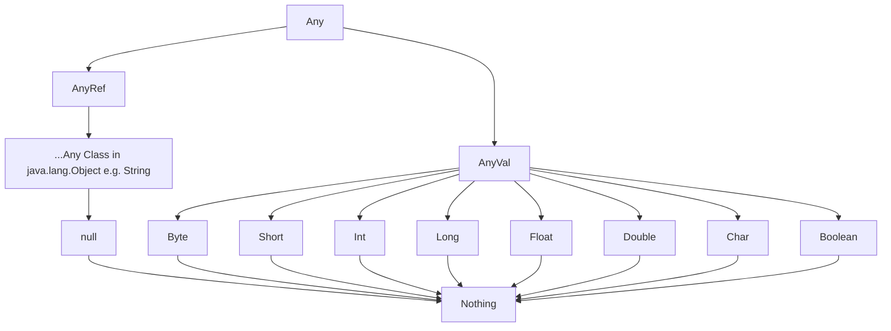

```mermaid
flowchart TD
    Any --> AnyVal;
    Any --> AnyRef;
    AnyVal --> Byte;
    AnyVal --> Short;
    AnyVal --> Int;
    AnyVal --> Long;
    AnyVal --> Float;
    AnyVal --> Double;
    AnyVal --> Char;
    AnyVal --> Boolean;
    AnyRef --> X[...Any Class in java.lang.Object e.g. String]
    X --> null;
    null --> Nothing;
    Byte --> Nothing;
    Short --> Nothing;
    Int --> Nothing;
    Long --> Nothing;
    Float --> Nothing;
    Double --> Nothing;
    Char --> Nothing;
    Boolean --> Nothing;
```
